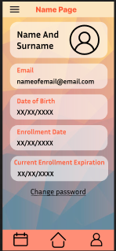

# GymApp

Aplicación para gestionar actividades y perfiles de un gimnasio, desarrollada en **Android Studio** utilizando **Jetpack Compose**.

## Características principales

- **Inicio de sesión**: Autenticación de usuarios mediante Firebase Authentication.
- **Registro en actividades**: Permite inscribirse en diferentes actividades del gimnasio.
- **Visualización de actividades registradas**: Muestra las actividades en las que el usuario se ha inscrito.
- **Perfil del usuario**: Información personal y relevante del usuario.
- **Generación de URL**: Creación de un URL único a partir del ID del usuario.

## Tecnologías utilizadas

- **Jetpack Compose**: Diseño de interfaz de usuario declarativa y moderna.
- **Firebase**:
  - Firebase Authentication: Autenticación segura de usuarios.
  - Firestore: Almacenamiento de datos en tiempo real.
  - Firebase Analytics: Seguimiento y análisis de la aplicación.
- **Navegación**: Implementada con `Navigation Compose`.
- **GSON**: Serialización y deserialización de datos JSON.
- **Coil y Glide**: Carga y visualización eficiente de imágenes.
- **ZXing**: Generación de códigos QR.

## Dependencias

El archivo **build.gradle** contine estas dependencias:

```gradle
implementation("androidx.navigation:navigation-compose:2.8.4")
implementation("androidx.lifecycle:lifecycle-viewmodel-compose:2.6.1")
implementation("androidx.lifecycle:lifecycle-runtime-ktx:2.6.1")
implementation(platform("com.google.firebase:firebase-bom:33.6.0"))
implementation("com.google.firebase:firebase-analytics")
implementation(platform("com.google.firebase:firebase-bom:32.8.0"))
implementation("com.google.firebase:firebase-auth")
implementation("com.google.firebase:firebase-firestore")
implementation("com.google.code.gson:gson:2.10.1")
implementation("io.coil-kt:coil-compose:2.2.2")
implementation("com.google.zxing:core:3.5.1")
implementation("com.github.bumptech.glide:compose:1.0.0-beta01")
implementation("com.google.accompanist:accompanist-systemuicontroller:0.30.1")
```

## Cosas por implementar

- **Uso de NFC**: Incorporación de la funcionalidad NFC para gestionar la tarjeta del gimnasio.


## Características principales

- **Inicio de sesión**: Autenticación de usuarios mediante Firebase Authentication.
- **Registro en actividades**: Permite inscribirse en diferentes actividades del gimnasio.
- **Visualización de actividades registradas**: Muestra las actividades en las que el usuario se ha inscrito.
- **Perfil del usuario**: Información personal y relevante del usuario.
- **Generación de URL**: Creación de un URL único a partir del ID del usuario.

## Tecnologías utilizadas

- **Jetpack Compose**: Diseño de interfaz de usuario declarativa y moderna.
- **Firebase**:
  - Firebase Authentication: Autenticación segura de usuarios.
  - Firestore: Almacenamiento de datos en tiempo real.
  - Firebase Analytics: Seguimiento y análisis de la aplicación.
- **Navegación**: Implementada con `Navigation Compose`.
- **GSON**: Serialización y deserialización de datos JSON.
- **Coil y Glide**: Carga y visualización eficiente de imágenes.
- **ZXing**: Generación de códigos QR.
- **Accompanist**: Control del sistema UI.

## Dependencias

Asegúrate de agregar las siguientes dependencias a tu archivo **build.gradle**:

```gradle
implementation("androidx.navigation:navigation-compose:2.8.4")
implementation("androidx.lifecycle:lifecycle-viewmodel-compose:2.6.1")
implementation("androidx.lifecycle:lifecycle-runtime-ktx:2.6.1")
implementation(platform("com.google.firebase:firebase-bom:33.6.0"))
implementation("com.google.firebase:firebase-analytics")
implementation(platform("com.google.firebase:firebase-bom:32.8.0"))
implementation("com.google.firebase:firebase-auth")
implementation("com.google.firebase:firebase-firestore")
implementation("com.google.code.gson:gson:2.10.1")
implementation("io.coil-kt:coil-compose:2.2.2")
implementation("com.google.zxing:core:3.5.1")
implementation("com.github.bumptech.glide:compose:1.0.0-beta01")
implementation("com.google.accompanist:accompanist-systemuicontroller:0.30.1")
```

## Diseño Inicial

A continuación se muestran las capturas de pantalla de como se pretendía ver la aplicación en un inicio diseñadas con Figma:

### Pantallas de Autenticación y Perfil
| Login                          | Home                           |
|--------------------------------|--------------------------------|
|      |        |
| **Perfil**                     |
|   |

### Otras Funcionalidades
| Actividad Registrada           | Rutinas mensuales           |
|--------------------------------|--------------------------------|
|  |      |
| **Rutina diaria**     | **Tienda de Puntos**           |
|  |  |
| **Clases dirigidas**                     |
|   |

## Cosas por implementar

- **Uso de NFC**: Incorporación de la funcionalidad NFC para gestionar la tarjeta del gimnasio.

